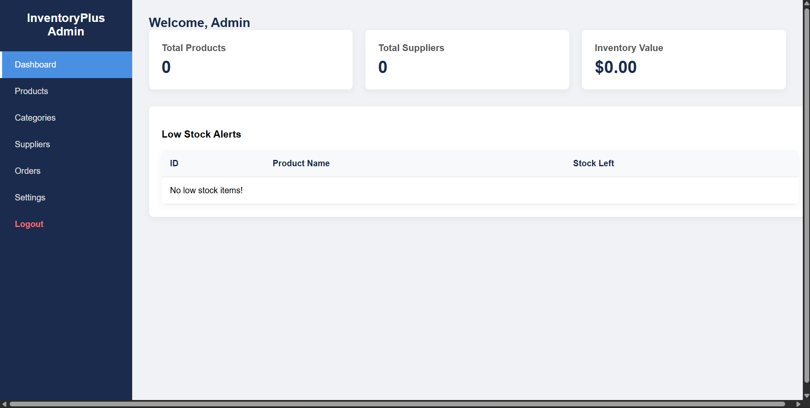
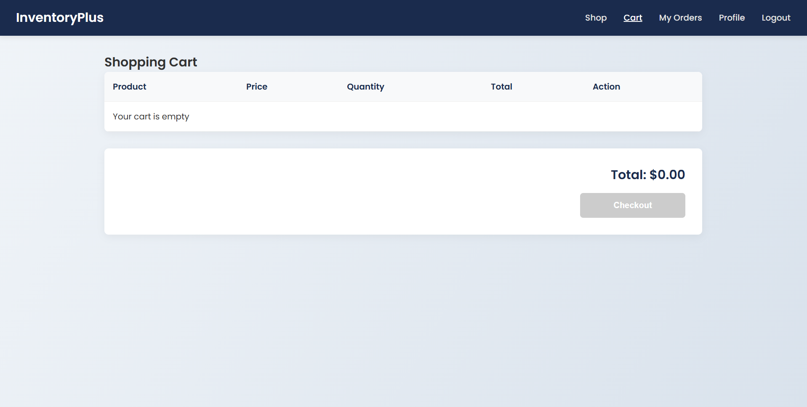

# Inventory Management System 📦

A robust, full-stack web application designed to track stock levels, manage products, and streamline inventory operations. Built with **Node.js**, **Express**, and **MySQL**, this system provides a responsive dashboard for real-time inventory monitoring and low-stock alerts.

## 🚀 Features

* **Dashboard Overview:** Real-time visualization of total products, low-stock items, and recent activity.
* **CRUD Operations:** Seamlessly **C**reate, **R**ead, **U**pdate, and **D**elete product records.
* **Relational Database:** Efficiently stores product details, supplier information, and categories using MySQL.
* **Stock Alerts:** Automated indicators for items running low on stock.
* **Search & Filter:** Quickly locate products within the database.
* **Responsive Design:** User-friendly interface accessible on desktop and mobile devices.

## 🛠️ Tech Stack

* **Backend:** Node.js, Express.js
* **Database:** MySQL
* **Frontend:** HTML5, CSS3, JavaScript (EJS or plain HTML depending on implementation)
* **Tools:** VS Code, Git, npm

## ⚙️ Installation & Setup

Follow these steps to get the project running on your local machine.

### Prerequisites
Ensure you have the following installed:
* [Node.js](https://nodejs.org/)
* [MySQL Server](https://dev.mysql.com/downloads/mysql/)

### 1. Clone the Repository
```bash
git clone [https://github.com/marialoid06/inventory-management.git](https://github.com/your-username/inventory-management.git)
cd inventory-management

 2. Install Dependencies
Initialize the project and install the required npm packages.
npm install

3. Database Configuration
Open your MySQL Workbench or Command Line.

Create a new database named inventory_db (or your preferred name).

Import the database.sql file located in this repository (if you haven't exported your SQL file yet, make sure to do so and include it!).

Alternatively, update the db_config.js or .env file with your MySQL credentials.

4. Configure Environment Variables
Create a .env file in the root directory (if you use one) and add your database details:
DB_HOST=localhost
DB_USER=root
DB_PASSWORD=your_password
DB_NAME=inventory_db
PORT=3000

5. Run the Application
Start the server:
npm start
# OR
node app.js

Open your browser and navigate to http://localhost:3000 to view the app.

📸 Screenshots




🤝 Contributing
Contributions are welcome! If you have suggestions for improvements or bug fixes, please feel free to:

Fork the repository.

Create a new branch (git checkout -b feature-branch).

Commit your changes.

Push to the branch and open a Pull Request.

📄 License
This project is licensed under the MIT License - see the LICENSE file for details.
